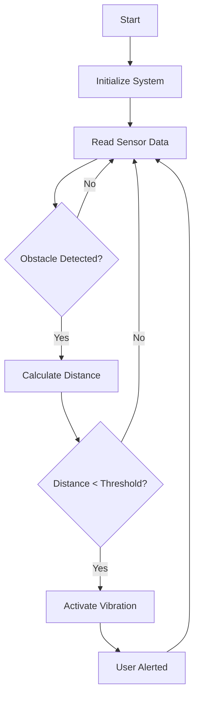

# Smart Footwear Assistive Walking System
> *An IoT-powered assistive device for visually impaired individuals using ultrasonic sensing and haptic feedback*

[](#)
[](#license)
[](#)
[](#)

---

## 📑 Table of Contents

- [🧠 Overview](#-overview)
- [🎯 Problem Statement](#-problem-statement)
- [⚙️ Working Principle](#️-working-principle)
- [🪫 Hardware Components](#-hardware-components)
- [💻 Software & Code](#-software--code)
- [🏗️ System Architecture](#️-system-architecture)
- [🔄 System Flow](#-system-flow)
- [👥 Team](#-team)
- [📂 Repository Structure](#-repository-structure)
- [🎓 Acknowledgments](#-acknowledgments)
- [📄 License](#-license)
- [🔗 Documentation Links](#-documentation-links)

---

## 🧠 Overview

**Smart Footwear Assistive Walking System** is an innovative IoT-based assistive technology designed to enhance mobility and safety for visually impaired individuals. The system integrates ultrasonic sensors, haptic feedback mechanisms, and intelligent processing to detect obstacles and provide real-time alerts during navigation.

This project combines **embedded systems**, **IoT connectivity**, and **assistive technology** to create an affordable, compact, and user-friendly solution that can be seamlessly integrated into everyday footwear.

### Key Highlights:
- ✅ Real-time obstacle detection using ultrasonic sensors
- ✅ Haptic feedback through vibration motors
- ✅ Arduino-based embedded control system
- ✅ Portable and wearable design
- ✅ Low-power consumption
- ✅ Scalable for future IoT enhancements

---

## 🎯 Problem Statement

Visually impaired individuals face significant challenges in detecting obstacles at ground level and mid-height during daily navigation. Traditional assistive devices like white canes have limitations:

- 🚫 Limited detection range
- 🚫 Ineffective against low-lying or suspended obstacles
- 🚫 Reactive rather than proactive approach
- 🚫 Requires constant hand engagement

**Our Solution:** A smart, wearable footwear system that provides **autonomous obstacle detection** and **instant haptic alerts** without requiring hand-held devices.

---

## ⚙️ Working Principle

The system operates on a **three-stage process**:

### 1. **Detection Phase**
- Ultrasonic sensors continuously emit sound waves
- Sensors detect obstacles within a programmable range (10-50 cm)
- Distance data is processed in real-time

### 2. **Processing Phase**
- Arduino microcontroller analyzes sensor data
- Calculates proximity and threat level
- Determines appropriate response intensity

### 3. **Alert Phase**
- Vibration motor activates with intensity proportional to proximity
- Different vibration patterns for various obstacle types
- User receives instant haptic feedback

```
[Obstacle] → [Ultrasonic Sensor] → [Arduino Processing] → [Vibration Alert] → [User Response]
```

---

## 🪫 Hardware Components

| Component | Model/Type | Quantity | Purpose |
|-----------|------------|----------|----------|
| **Microcontroller** | Arduino Nano/Uno | 1 | Central processing unit |
| **Ultrasonic Sensor** | HC-SR04 | 2 | Obstacle detection (front & sides) |
| **Vibration Motor** | 3V Coin Motor | 2 | Haptic feedback |
| **Power Supply** | 9V Battery / Li-ion | 1 | System power |
| **Resistors** | Various | As needed | Circuit protection |
| **Connecting Wires** | Jumper Wires | - | Connections |
| **PCB/Breadboard** | Custom/Standard | 1 | Component mounting |
| **Footwear Base** | Shoe/Insole | 1 | Wearable platform |

### Component Specifications:

**HC-SR04 Ultrasonic Sensor:**
- Operating Voltage: 5V DC
- Detection Range: 2cm - 400cm
- Accuracy: ±3mm
- Measuring Angle: 15°

**Arduino Nano:**
- Operating Voltage: 5V
- Digital I/O Pins: 14
- Analog Input Pins: 8
- Flash Memory: 32KB

---

## 💻 Software & Code

### Key Libraries:
```cpp
#include <NewPing.h>        // Ultrasonic sensor library
```

### Core Functions:

#### 1. Obstacle Detection
```cpp
int getDistance() {
  // Trigger ultrasonic pulse
  // Measure echo return time
  // Calculate distance
  return distance;
}
```

#### 2. Alert System
```cpp
void hapticAlert(int distance) {
  if (distance < THRESHOLD) {
    // Activate vibration motor
    // Intensity based on proximity
  }
}
```

#### 3. Main Loop
```cpp
void loop() {
  int dist = getDistance();
  hapticAlert(dist);
  delay(100);
}
```

**[📥 View Full Source Code](./Smart_Footwear_Assistive_Walking_System/Smart_Footwear_Assistive_Walking_System.ino)**

---

## 🏗️ System Architecture

```
┌─────────────────────────────────────────────────────────────┐
│                   SMART FOOTWEAR SYSTEM                      │
└─────────────────────────────────────────────────────────────┘
                              │
        ┌─────────────────────┼─────────────────────┐
        │                     │                     │
   ┌────▼─────┐         ┌────▼──────┐        ┌────▼─────┐
   │  Sensor  │         │  Arduino  │        │ Vibration│
   │  Module  │────────▶│Controller │────────▶│  Module  │
   └──────────┘         └───────────┘        └──────────┘
        │                     │                     │
   [Detection]          [Processing]           [Feedback]
```

### Data Flow:
1. **Input:** Ultrasonic sensors detect obstacles
2. **Process:** Arduino analyzes distance data
3. **Output:** Vibration motors provide haptic feedback
4. **Loop:** Continuous monitoring (10Hz refresh rate)

---

## 🔄 System Flow



---

## 👥 Team

**PROJECT MEMBERS:**

1. **V. SRIRAM** (20700398)
2. **R. SIRANJEEVEE** (20700397)
3. **G. VARUN** (20700400)
4. **J. C. KUBER** (20700373)
5. **V. VENKAT CHARAN** (20700401)
6. **YASHWANTHA SAI G.K** (20700406)

**GUIDE:** Mrs. S.P. CHITRA (HOD, Dept. of Mechatronics)

---

## 📂 Repository Structure

```
DESIGN-AND-MODELLING-OF-FOOTWEAR-FOR-VISUALLY-IMPAIRED/
│
├── Smart_Footwear_Assistive_Walking_System/
│   └── Smart_Footwear_Assistive_Walking_System.ino  # Main Arduino code
│
├── docs/
│   ├── DESIGN AND MODELLING OF FOOTWEAR FOR VISUALLY IMPAIRED REPORT.pdf
│   ├── DESIGN AND MODELLING OF FOOTWEAR FOR VISUALLY IMPAIRED REPORT.docx
│   └── Project_Presentation.pptx
│
├── README.md                                         # Project documentation
└── LICENSE                                          # MIT License
```

---

## 🎓 Acknowledgments

We would like to express our sincere gratitude to:

- **Mrs. S.P. Chitra (HOD, Mechatronics and Project Guide)** – For her invaluable guidance and support throughout the project
- **Department of Mechatronics** – For providing resources and facilities
- **Our Institution** – For encouraging innovation and assistive technology research
- **Visually Impaired Community** – For their insights and feedback during user testing
- **Open Source Community** – For Arduino libraries and development tools

This project was developed as part of our **Final Year Diploma Project** in the academic year 2024–2025.

---

## 📄 License

This project is licensed under the **MIT License** - see the [LICENSE](LICENSE) file for details.

```
MIT License

Copyright (c) 2024-2025 Team Smart Footwear

Permission is hereby granted, free of charge, to any person obtaining a copy
of this software and associated documentation files (the "Software"), to deal
in the Software without restriction, including without limitation the rights
to use, copy, modify, merge, publish, distribute, sublicense, and/or sell
copies of the Software, and to permit persons to whom the Software is
furnished to do so, subject to the following conditions:

The above copyright notice and this permission notice shall be included in all
copies or substantial portions of the Software.

THE SOFTWARE IS PROVIDED "AS IS", WITHOUT WARRANTY OF ANY KIND, EXPRESS OR
IMPLIED, INCLUDING BUT NOT LIMITED TO THE WARRANTIES OF MERCHANTABILITY,
FITNESS FOR A PARTICULAR PURPOSE AND NONINFRINGEMENT. IN NO EVENT SHALL THE
AUTHORS OR COPYRIGHT HOLDERS BE LIABLE FOR ANY CLAIM, DAMAGES OR OTHER
LIABILITY, WHETHER IN AN ACTION OF CONTRACT, TORT OR OTHERWISE, ARISING FROM,
OUT OF OR IN CONNECTION WITH THE SOFTWARE OR THE USE OR OTHER DEALINGS IN THE
SOFTWARE.
```

---

## 🔗 Documentation Links

### 📄 Project Reports:
- [📕 Full Project Report (PDF)](./docs/DESIGN%20AND%20MODELLING%20OF%20FOOTWEAR%20FOR%20VISUALLY%20IMPAIRED%20REPORT.pdf)
- [📘 Project Report (DOCX)](./docs/DESIGN%20AND%20MODELLING%20OF%20FOOTWEAR%20FOR%20VISUALLY%20IMPAIRED%20REPORT.docx)

### 📊 Presentation:
- [🎞️ Project Presentation (PPT)](./docs/Project_Presentation.pptx)

### 💻 Source Code:
- [⚙️ Main Arduino Code](./src/Smart_Footwear_Assistive_Walking_System.ino)

---

## 🌟 Future Enhancements

- 🌐 **IoT Integration**: Real-time location tracking via GPS and cloud connectivity
- 📱 **Mobile App**: Companion app for configuration and emergency alerts
- 🗣️ **Voice Feedback**: Audio directions using TTS (Text-to-Speech)
- 🤖 **AI/ML**: Adaptive learning for different walking patterns
- 🔋 **Solar Charging**: Extended battery life with solar panels
- 🌧️ **Weather Resistance**: Enhanced waterproofing for all conditions

---

## 📞 Contact

For queries, suggestions, or collaboration:

- **Project Lead**: Sriram V
- **Hardware Engineer**: Surothaaman R
- **Documentation Lead**: Pavithra M
- **Supervisor**: Ms. V. Swedha

---

<div align="center">

### ⭐ If you find this project helpful, please consider giving it a star!

**Made with ❤️ by Team Smart Footwear**

*Empowering Independence Through Technology*

</div>
